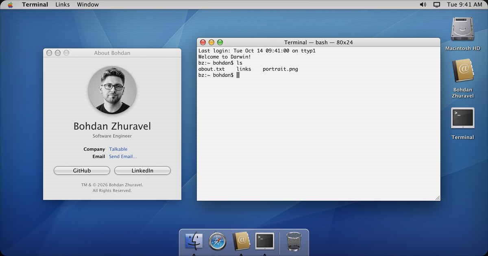

# bohdan.zhuravel.bz

Personal site of Bohdan Zhuravel: a Mac OS X 10.3 Panther desktop that runs in the browser.
Static files only, no build step. Also served from zhuravel.bz, bohdan.bz and bohdanzhuravel.com (redirects).



Finder, Terminal, Safari 1.2, a Dock with the genie effect, Exposé, Flurry, a CRT filter and sounds.

## Run locally

Open `index.html` in a browser (works from `file://`), or serve the folder:

```sh
python3 -m http.server 8000
```

## Layout

| Path | What |
| --- | --- |
| `index.html` | the desktop: window manager, menus, Dock, genie, Exposé, power menu |
| `js/shell.js` | pretend bash and `BzFS`, the fake home folder shared with the Finder |
| `js/finder.js` | Finder (icon/list views, drag to Trash, labels, viewers) |
| `js/safari.js`, `js/safari-bridge.js` | Safari 1.2 window showing `2004/`, and the script those pages use to talk to it |
| `js/toys.js` | `say`, `fortune`, `banner`, `emacs` (`M-x doctor`, `M-x tetris`), kernel panic |
| `js/sounds.js`, `js/keysound.js` | UI sounds, sampled keyboard, startup chime (`chime-data.js`) |
| `js/crt.js`, `js/screensaver.js` | CRT overlay, Flurry screensaver wrapper |
| `js/lazy.js` | loads Flurry, the chime, toy data and key recordings the first time they're needed |
| `js/email.js` | the contact address, decoded only when someone reaches for it |
| `2004/` | the site as it might have looked in 2004 (shown inside Safari) |
| `vendor/` | third-party code and data, each with its LICENSE |
| `img/` | portraits, wallpaper, icons, and `og.jpg` for link previews |

## Credits

- Flurry screensaver: [RoyCurtis/Flurry-WebGL](https://github.com/RoyCurtis/Flurry-WebGL), MIT (`vendor/flurry/`)
- ELIZA: [urbanautomaton/eliza-js](https://github.com/urbanautomaton/eliza-js), MIT; BSD `fortune` and `banner` data, BSD-3-Clause (`vendor/toys/`)
- Keyboard recordings: robni7 on Freesound, CC0 (details in `SOUND-CREDITS.txt`)
- Wallpaper, icons (`img/icons/SOURCES.txt`) and the startup chime are Apple artwork and sound, © Apple Inc.; used here as a personal homage
